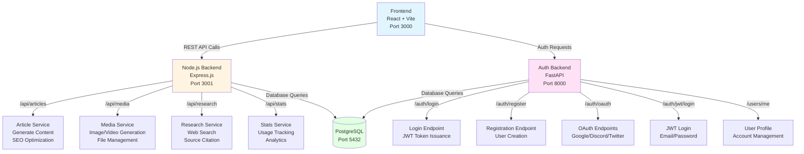

# Nova‑XFinity AI — Backend Architecture

**Description:** Provides a structural overview of the Nova‑XFinity AI backend system, including services, data flows, routing strategy, and component responsibilities.  
**Last Updated:** 2026-01-07  
**Status:** Stable

## Table of Contents

- [1. Overview](#1-overview)
- [2. Services Breakdown](#2-services-breakdown)
  - [🧩 Node.js API Backend](#nodejs-api-backend)
  - [🔐 FastAPI Auth Backend](#fastapi-auth-backend)
  - [🗃️ PostgreSQL Database](#postgresql-database)
- [3. Project Structure (Node Backend)](#3-project-structure-node-backend)
  - [Detailed Directory Structure](#detailed-directory-structure)
- [4. API Design](#4-api-design)
- [5. Security Features](#5-security-features)
- [6. Planned Upgrades](#6-planned-upgrades)
- [7. Core Services](#7-core-services)
  - [Authentication System](#authentication-system)
  - [API Services](#api-services)
  - [Caching Layer (Redis)](#caching-layer-redis)
  - [Middleware Stack](#middleware-stack)

---

## 1. Overview

The backend is built using a **modular Node.js (Express)** architecture, containerized via Docker, and orchestrated using `docker-compose`.
It consists of multiple services working in sync:

* **API Service (Node.js)** — Express app handling core API routes
* **Auth Service (FastAPI)** — Handles OAuth and email authentication flows
* **Database (PostgreSQL)** — Stores users, subscriptions, referrals, and usage

### Backend Routing Architecture



---

## 2. Services Breakdown

### 🧩 Node.js API Backend

* Built with **Express.js**
* Handles user roles, subscription logic, tool access, and referrals
* Rate limits + credits management
* Interfaces with PostgreSQL

### 🔐 FastAPI Auth Backend

* Handles Google & Discord OAuth login
* Manages email verification, password reset
* Token issuance (access & refresh)
* Email template rendering and SMTP dispatch

### 🗃️ PostgreSQL Database

* Used by both Node and Python services
* Contains:

  * Users & roles
  * Subscriptions & plans
  * Referral trees
  * Tool usage history
  * Credit balance + rewards

---

## 3. Project Structure (Node Backend)

```
/backend
├── controllers/        # Route logic and service handlers
├── middleware/         # Auth guards, error handling
├── routes/             # API route maps (v1/public/private)
├── services/           # DB logic, emails, referrals, limits
├── utils/              # Token helpers, validation, constants
├── prisma/             # DB schema, migrations
└── index.js            # Express app entry point
```

### Detailed Directory Structure

For more detailed implementation structure:

```
backend/
├── src/
│   ├── index.js              # Entry point
│   ├── app.js                # Express app configuration
│   ├── config/               # Configuration files
│   │   ├── database.js       # Prisma client setup
│   │   ├── redis.js          # Redis client setup
│   │   └── env.js            # Environment validation
│   ├── routes/               # API routes
│   │   ├── auth.routes.js    # Authentication routes
│   │   ├── articles.routes.js
│   │   ├── media.routes.js
│   │   ├── research.routes.js
│   │   └── settings.routes.js
│   ├── controllers/          # Route handlers
│   ├── services/             # Business logic
│   │   ├── auth.service.js
│   │   ├── ai.service.js     # Multi-provider AI service
│   │   ├── article.service.js
│   │   ├── media.service.js
│   │   ├── research.service.js
│   │   └── email.service.js
│   ├── models/               # Database models (Prisma)
│   │   └── schema.prisma
│   ├── middleware/           # Express middleware
│   │   ├── auth.middleware.js
│   │   ├── error.middleware.js
│   │   ├── validation.middleware.js
│   │   └── rateLimit.middleware.js
│   ├── utils/                # Helper functions
│   │   ├── encryption.js     # API key encryption
│   │   ├── validation.js     # Input validation
│   │   └── logger.js         # Logging utility
│   └── templates/            # Email templates
├── tests/                    # Test files
├── migrations/               # Prisma migrations
├── docker-compose.yml        # Docker services
├── .env.example             # Environment variables template
└── package.json
```

---

## 4. API Design

* **RESTful structure**, versioned under `/api/v1/`
* **Protected routes** require access token
* **Admin routes** gated by role middleware
* JSON responses with standard format `{ success, data, message }`

---

## 5. Security Features

* OAuth with state protection and fallback logic
* CSRF tokens in forms
* Rate limiting with cooldown tracking
* Session tokens with rolling expiration
* Route-level RBAC guards for sensitive endpoints

---

## 6. Planned Upgrades

* Move Auth to a dedicated service with SSO support
* Replace Prisma with native query layer (Phase 2)
* Add audit logs and admin action tracking
* Scale FastAPI into microservice (v2 OAuth gateway)

---

---

## 7. Core Services

### Authentication System
- JWT-based authentication (access tokens: 15 min, refresh tokens: 7 days)
- Password hashing (bcrypt, 10 rounds)
- Rate limiting on auth endpoints
- Account lockout after failed attempts
- CSRF protection

### API Services
- **AI Service**: Multi-provider support (Gemini, OpenAI, Claude, Llama) with automatic fallback
- **Article Service**: Draft management, article generation orchestration, SEO optimization
- **Media Service**: Image/video generation, file storage and retrieval, CDN integration
- **Research Service**: Google Search grounding integration, query caching, source citation
- **Email Service**: Welcome emails, verification, password reset, autoresponder system

### Caching Layer (Redis)
- Article drafts (5 min TTL)
- Research results (1 hour TTL)
- User sessions
- API rate limit counters
- Frequently accessed settings

### Middleware Stack
- **Authentication Middleware**: JWT token validation, user context injection, RBAC
- **Validation Middleware**: Request schema validation, input sanitization
- **Error Handling Middleware**: Centralized error handling, error logging, user-friendly messages
- **Rate Limiting Middleware**: Per-IP and per-user rate limiting, endpoint-specific limits

---

**Note:** Content merged from `backend.md` (deleted) - Jan 07, 2026

> Last updated: Jan 07, 2026

---

## Related Documents

- [Frontend Architecture](frontend-architecture.md) - Frontend system architecture
- [Database Schema](database-schema.md) - Database structure and design
- [API Documentation](api.md) - API endpoints and specifications
- [Auth System](auth-system.md) - Authentication system architecture
- [Provider Integration](provider-integration.md) - AI provider integration patterns
- [Docker Containerization System](../development/docker-containerization-system.md) - Docker-based service orchestration and development workflow
