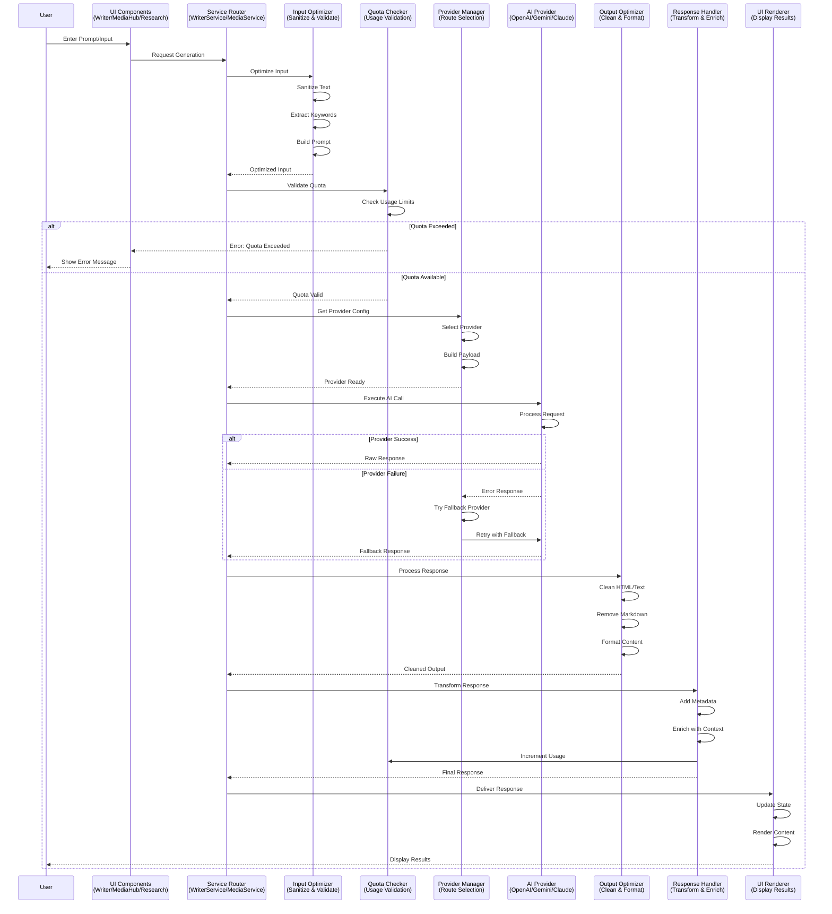

# AI Service Flow

## Overview

Nova‑XFinity provides a unified, multi-provider AI service architecture that handles all AI-powered operations across the platform. The system seamlessly routes user requests to appropriate AI providers (Gemini, OpenAI, Anthropic, Stability AI, etc.) based on service type, user preferences, and provider capabilities. 

This document describes the complete lifecycle of an AI service call, from the moment a user triggers an action in the frontend, API, or plugin, through routing and execution, to final response delivery.

**Key Principles:**
- **Provider Abstraction:** Service calls are provider-agnostic at the application layer
- **Intelligent Routing:** Automatic provider selection based on service requirements
- **Graceful Fallback:** Automatic fallback to alternative providers on failure
- **Quota Enforcement:** Built-in usage tracking and quota management
- **Response Standardization:** Consistent response formatting across all providers

### AI Service Flow Diagram



---

## Input Entry Points

AI service calls can originate from three primary entry points:

### 1. Frontend Components

**Writer Module** (`components/writer/Writer.js`)
- Article generation: `generateMetadata()`, `generateOutline()`, `generateSection()`
- SEO analysis: `analyzeSEO()`
- CTA generation: `generateCTA()`

```javascript
// Example: Starting article generation
const handleStartGeneration = async () => {
  const meta = await generateMetadata(
    config.topic, 
    config.keywords, 
    config.articleType,
    // ... other parameters
  );
};
```

**MediaHub Component** (`components/MediaHub.js`)
- Image generation: `generateImage()`, `editImage()`
- Video generation: `generateVideo()`
- Audio generation: `generateAudio()`

**ImageBlock Component** (`components/writer/ImageBlock.js`)
- Inline image generation during article creation
- AI-powered image editing

**Research Component** (`components/Research.js`)
- Research queries: `performResearch()`
- SEO analysis: `analyzeSEO()`
- Plagiarism checks: `checkPlagiarism()`

### 2. Backend API Routes

**Article Routes** (`backend/src/routes/articles.routes.js`)
- `POST /api/articles` - Generate articles
- `POST /api/articles/:id/publish` - Publish to WordPress

**Media Routes** (`backend/src/routes/media.routes.js`)
- `POST /api/media/images` - Generate images
- `POST /api/media/videos` - Generate videos

**Research Routes** (`backend/src/routes/research.routes.js`)
- `POST /api/research/query` - Execute research queries

**Example Route Handler:**
```javascript
router.post('/images', checkQuota('images'), async (req, res) => {
  const { prompt, style, aspectRatio } = req.body;
  // AI service call happens here
  await incrementUsage(req.user.id, 'imagesGenerated', 1);
});
```

### 3. WordPress Plugin Integration

**Plugin API** (`wordpress-plugin/finity-ai-seo-writer.php`)
- Article publishing via WordPress REST API
- Cross-origin communication via postMessage
- Iframe-based integration with Nova‑XFinity frontend

**Plugin Message Flow:**
```javascript
// Plugin sends message to iframe
window.postMessage({
  type: 'finity-publish',
  payload: { title, content, metadata }
}, appUrl);
```

---

## Request Structuring

Before routing to an AI provider, user input undergoes several transformation steps:

### 1. Input Optimization

**Input Sanitization** (`utils/inputOptimizer.js`)

```javascript
// Text sanitization
export const sanitizeText = (text) => {
  return text
    .trim()
    .replace(/\s+/g, ' ') // Normalize whitespace
    .replace(/[^\w\s\-.,!?;:()\[\]{}'"]/g, '') // Remove special chars
    .substring(0, 5000); // Limit length
};

// Keyword optimization
export const optimizeKeywords = (keywords) => {
  return keywords
    .map(kw => sanitizeText(kw))
    .filter(kw => kw.length > 0 && kw.length < 50)
    .filter((kw, index, self) => self.indexOf(kw) === index) // Dedupe
    .slice(0, 10); // Limit to 10
};
```

### 2. Prompt Construction

Prompts are constructed by combining:
- User input (topic, keywords, requirements)
- System context (article type, tone, language)
- System instructions (SEO guidelines, formatting rules)

**Example Prompt Construction:**
```javascript
// From services/geminiService.js
export const generateMetadata = async (topic, keywords, articleType, ...) => {
  const systemPrompt = `${SYSTEM_INSTRUCTIONS}\nReturn a JSON object with: focusKeyphrase, seoTitle, slug, metaDescription, and featuredImage object.`;
  
  const prompt = `Topic: "${topic}"\nKeywords: "${keywords.join(', ')}"\nPOV: ${pov}\nType: ${articleType}\nSourceContext: ${sourceContext}\nManualFocus: ${manualFocusKeyphrase}`;
  
  const text = await callAI(prompt, systemPrompt, true); // jsonMode = true
  return JSON.parse(cleanAIOutput(text) || '{}');
};
```

### 3. System Instructions

**System Instructions** (`constants.js`)
- Provider-specific optimization strategies
- SEO and readability requirements
- Output format specifications
- Content guidelines

```javascript
export const SYSTEM_INSTRUCTIONS = `ROLE: You are the Nova‑XFinity AI SEO Content Engine, a Senior Technical Journalist. Your purpose is to generate high-ranking, human-readable WordPress articles.

I. OUTPUT ARCHITECTURE & LAYOUT
Context: You output content for the Editor Workspace (Layer 2).
Strict Format: Output RAW HTML ONLY.
Negative Constraints: 
- NO conversational filler.
- NO markdown code fences.
- Start immediately with the first <h1> or <h2> tag.

V. [PROVIDER SPECIFIC LOGIC]
- If Gemini: Prioritize high-density context from RSS feeds.
- If Claude: Prioritize technical accuracy and deep reasoning.
- If OpenAI: Prioritize creative marketing hooks and SEO titles.
- If Llama: Prioritize speed and concise summaries.
`;
```

### 4. Request Payload Shaping

Provider-specific payload structures:

**Gemini (GoogleGenAI SDK):**
```javascript
{
  model: 'gemini-3-pro-preview',
  contents: prompt,
  config: {
    systemInstruction: systemPrompt,
    responseMimeType: jsonMode ? "application/json" : undefined
  }
}
```

**OpenAI-Compatible (OpenAI, Llama/Groq):**
```javascript
{
  model: 'gpt-4o',
  messages: [
    { role: 'system', content: systemPrompt },
    { role: 'user', content: prompt }
  ],
  response_format: jsonMode ? { type: "json_object" } : undefined
}
```

**Anthropic (Claude):**
```javascript
{
  model: 'claude-3-5-sonnet-latest',
  system: systemPrompt,
  messages: [{ role: 'user', content: prompt }],
  max_tokens: 4096
}
```

---

## Provider Routing

The provider routing layer (`services/ai/providerManager.js`, `services/geminiService.js`) determines which AI provider handles each request.

### Provider Selection Logic

**Step 1: Configuration Retrieval**

```javascript
export const getProviderConfig = () => {
  const settings = getSavedSettings(); // From localStorage
  const provider = settings.provider || 'gemini';
  
  const configs = {
    gemini: { 
      key: process.env.API_KEY, 
      baseUrl: 'https://generativelanguage.googleapis.com', 
      model: 'gemini-3-pro-preview' 
    },
    openai: { 
      key: settings.openaiKey, 
      baseUrl: 'https://api.openai.com/v1/chat/completions', 
      model: 'gpt-4o' 
    },
    anthropic: { 
      key: settings.claudeKey, 
      baseUrl: 'https://api.anthropic.com/v1/messages', 
      model: 'claude-3-5-sonnet-latest' 
    },
    llama: { 
      key: settings.llamaKey, 
      baseUrl: 'https://api.groq.com/openai/v1/chat/completions', 
      model: 'llama-3.3-70b-versatile' 
    }
  };
  
  return { id: provider, ...configs[provider] };
};
```

**Step 2: Service Type-Based Routing**

Different service types map to specific providers:

| Service Type | Primary Provider | Alternative Providers |
|-------------|------------------|----------------------|
| **Text Generation** | User preference (Gemini/OpenAI/Claude/Llama) | All LLM providers |
| **Image Generation** | Gemini (gemini-2.5-flash-image) | Stability AI, Replicate |
| **Video Generation** | Gemini Veo (veo-3.1-fast-generate-preview) | Runway, Luma |
| **Audio Generation** | Gemini TTS (gemini-2.5-flash-preview-tts) | Suno, ElevenLabs |
| **Research/Grounded Search** | Gemini (with googleSearch tool) | OpenAI (with web search) |
| **Vector Search** | Pinecone / Weaviate | Custom embeddings |

**Step 3: Fallback Chain**

Each provider has a configured fallback chain:
- **OpenAI** → Gemini → Claude → Llama
- **Gemini** → OpenAI → Claude
- **Anthropic** → Gemini → OpenAI
- **Llama** → OpenAI → Gemini

### Provider-Specific Implementations

#### 1. OpenAI (Chat Completions)

**Use Cases:**
- Text generation (articles, sections, metadata)
- Code generation
- Creative writing

**Routing Code:**
```javascript
// From services/geminiService.js
if (config.id === 'openai') {
  const payload = {
    model: config.model, // 'gpt-4o'
    messages: [
      { role: 'system', content: systemPrompt },
      { role: 'user', content: prompt }
    ],
    ...(jsonMode ? { response_format: { type: "json_object" } } : {})
  };
  
  const headers = {
    'Content-Type': 'application/json',
    'Authorization': `Bearer ${config.key}`
  };
  
  const res = await fetch(config.baseUrl, {
    method: 'POST',
    headers,
    body: JSON.stringify(payload)
  });
  
  const data = await res.json();
  return data.choices[0].message.content;
}
```

#### 2. Google Gemini (Multi-modal)

**Use Cases:**
- Text generation with RSS context
- Grounded search and research
- Image generation (gemini-2.5-flash-image)
- Video generation (veo-3.1-fast-generate-preview)
- Audio/TTS (gemini-2.5-flash-preview-tts)

**Routing Code:**
```javascript
if (config.id === 'gemini') {
  const ai = new GoogleGenAI({ apiKey: config.key });
  
  // Text generation
  const response = await ai.models.generateContent({
    model: config.model, // 'gemini-3-pro-preview'
    contents: prompt,
    config: {
      systemInstruction: systemPrompt,
      ...(jsonMode ? { responseMimeType: "application/json" } : {})
    }
  });
  return response.text;
  
  // Research with grounded search
  const researchResponse = await ai.models.generateContent({
    model: 'gemini-3-pro-preview',
    contents: `Deep Research: ${query}`,
    config: { tools: [{ googleSearch: {} }] }
  });
  
  // Image generation
  const imageResponse = await ai.models.generateContent({
    model: 'gemini-2.5-flash-image',
    contents: { parts: [{ text: prompt }] },
    config: { imageConfig: { aspectRatio } }
  });
  
  // Video generation (async operation)
  let operation = await ai.models.generateVideos({
    model: 'veo-3.1-fast-generate-preview',
    prompt: `Visual Style: ${style}. Duration: ${duration}. ${prompt}`,
    config: { 
      numberOfVideos: 1, 
      resolution, 
      aspectRatio 
    }
  });
  
  // Poll until completion
  while (!operation.done) {
    await new Promise(r => setTimeout(r, 10000));
    operation = await ai.operations.getVideosOperation({operation});
    if (operation.error) throw new Error(operation.error.message);
  }
}
```

#### 3. Stability AI / Replicate (Image Generation)

**Use Cases:**
- High-quality image generation
- Fine-tuned model inference
- Style transfer

**Planned Implementation:**
```javascript
// Future implementation
if (config.id === 'stability' || config.id === 'replicate') {
  const response = await fetch('https://api.stability.ai/v1/generation/stable-diffusion-xl-1024-v1-0/text-to-image', {
    method: 'POST',
    headers: {
      'Content-Type': 'application/json',
      'Authorization': `Bearer ${config.key}`
    },
    body: JSON.stringify({
      text_prompts: [{ text: prompt }],
      cfg_scale: 7,
      height: 1024,
      width: 1024,
      steps: 30
    })
  });
  
  const data = await response.json();
  return data.artifacts[0].base64;
}
```

#### 4. Suno / Runway / Luma (Media Generation)

**Use Cases:**
- Music generation (Suno)
- Video generation (Runway, Luma)
- Animation creation

**Planned Implementation:**
```javascript
// Future implementation for Suno
if (config.id === 'suno') {
  const response = await fetch('https://api.suno.ai/v1/generate', {
    method: 'POST',
    headers: {
      'Authorization': `Bearer ${config.key}`,
      'Content-Type': 'application/json'
    },
    body: JSON.stringify({
      prompt: prompt,
      duration: duration,
      style: style
    })
  });
  
  // Handle async job polling similar to video generation
}

// Future implementation for Runway
if (config.id === 'runway') {
  // Similar pattern with async job management
}
```

#### 5. Anthropic Claude (Fallback LLM)

**Use Cases:**
- Technical content generation
- Deep reasoning tasks
- Alternative to OpenAI/Gemini

**Routing Code:**
```javascript
if (config.id === 'anthropic') {
  const payload = {
    model: config.model, // 'claude-3-5-sonnet-latest'
    system: systemPrompt,
    messages: [{ role: 'user', content: prompt }],
    max_tokens: 4096
  };
  
  const headers = {
    'Content-Type': 'application/json',
    'x-api-key': config.key,
    'anthropic-version': '2023-06-01'
  };
  
  const res = await fetch(config.baseUrl, {
    method: 'POST',
    headers,
    body: JSON.stringify(payload)
  });
  
  const data = await res.json();
  return data.content[0].text;
}
```

#### 6. Pinecone / Weaviate (Vector Search)

**Use Cases:**
- Semantic search across content
- Embedding generation and storage
- Memory/context retrieval for AI agents

**Planned Implementation:**
```javascript
// Future implementation
if (config.id === 'pinecone' || config.id === 'weaviate') {
  // Generate embedding using OpenAI or Gemini
  const embedding = await generateEmbedding(query);
  
  // Search vector database
  const results = await vectorDB.query({
    vector: embedding,
    topK: 10,
    includeMetadata: true
  });
  
  // Use results as context for AI generation
  const context = results.matches.map(r => r.metadata.text).join('\n');
  return await callAI(`${query}\n\nContext:\n${context}`, systemPrompt);
}
```

### Fallback Mechanism

**Automatic Fallback Logic:**
```javascript
const callAI = async (prompt, systemPrompt, jsonMode = false) => {
  const config = getProviderConfig();
  
  try {
    // Primary provider attempt
    if (config.id === 'gemini') {
      // Gemini implementation
    } else if (['openai', 'llama'].includes(config.id)) {
      // OpenAI-compatible implementation
    } else if (config.id === 'anthropic') {
      // Anthropic implementation
    }
  } catch (error) {
    console.warn("Primary provider failed, attempting fallback to Gemini...", error);
    
    // Silent Fallback to Gemini if it's not the primary
    if (config.id !== 'gemini') {
      const ai = new GoogleGenAI({ apiKey: getApiKey() });
      const response = await ai.models.generateContent({
        model: 'gemini-3-flash-preview',
        contents: `[FALLBACK MODE] ${prompt}`,
        config: { systemInstruction: systemPrompt }
      });
      return response.text;
    }
    throw error;
  }
};
```

---

## Execution Layer

The execution layer handles HTTP requests, retries, rate limiting, and timeout management.

### Request Execution

**Standard HTTP Requests:**
```javascript
const res = await fetch(config.baseUrl, {
  method: 'POST',
  headers: {
    'Content-Type': 'application/json',
    ...(config.id === 'openai' && { 'Authorization': `Bearer ${config.key}` }),
    ...(config.id === 'anthropic' && { 
      'x-api-key': config.key, 
      'anthropic-version': '2023-06-01'
    })
  },
  body: JSON.stringify(payload)
});

if (!res.ok) {
  throw new Error(`Provider ${config.id} failed: ${res.statusText}`);
}
```

### SDK-Based Execution

**Google Gemini SDK:**
```javascript
import { GoogleGenAI, Type, Modality } from "@google/genai";

const ai = new GoogleGenAI({ apiKey: config.key });
const response = await ai.models.generateContent({
  model: config.model,
  contents: prompt,
  config: { systemInstruction: systemPrompt }
});
```

### Async Operation Polling

**Long-Running Operations (Video Generation):**
```javascript
export const generateVideo = async (prompt, style, resolution, aspectRatio, duration, startFrameBase64 = null) => {
  let operation = await ai.models.generateVideos({
    model: 'veo-3.1-fast-generate-preview',
    prompt: `Visual Style: ${style}. Duration: ${duration}. ${prompt}`,
    config: { numberOfVideos: 1, resolution, aspectRatio }
  });
  
  // Poll until completion
  while (!operation.done) {
    await new Promise(r => setTimeout(r, 10000)); // 10 second intervals
    operation = await ai.operations.getVideosOperation({operation});
    
    if (operation.error) {
      throw new Error(`Video Generation Operation Failed: ${operation.error.message}`);
    }
  }
  
  const videoMeta = operation.response?.generatedVideos?.[0]?.video;
  return videoMeta.uri;
};
```

### Retry Logic (Planned)

**Future Implementation:**
```javascript
async function executeWithRetry(fn, maxRetries = 3, backoffMs = 1000) {
  for (let attempt = 0; attempt < maxRetries; attempt++) {
    try {
      return await fn();
    } catch (error) {
      if (attempt === maxRetries - 1) throw error;
      
      // Exponential backoff
      await new Promise(r => setTimeout(r, backoffMs * Math.pow(2, attempt)));
    }
  }
}
```

### Rate Limiting (Planned)

**Future Implementation:**
- Token bucket algorithm per provider
- Request queuing for high-volume scenarios
- Per-user rate limiting based on subscription tier

### Timeout Management

**Current Implementation:**
- Browser default fetch timeout
- Long-running operations use polling with intervals

**Planned Implementation:**
```javascript
const controller = new AbortController();
const timeoutId = setTimeout(() => controller.abort(), 30000); // 30s timeout

try {
  const res = await fetch(url, {
    signal: controller.signal,
    // ... other options
  });
} finally {
  clearTimeout(timeoutId);
}
```

---

## Response Processing

Provider responses undergo standardized processing before delivery to clients.

### 1. Response Extraction

**Provider-Specific Extraction:**
```javascript
// OpenAI-compatible
const data = await res.json();
return data.choices[0].message.content;

// Anthropic
const data = await res.json();
return data.content[0].text;

// Gemini SDK
return response.text;

// Gemini Image
for (const part of response.candidates[0].content.parts) {
  if (part.inlineData) {
    return `data:image/png;base64,${part.inlineData.data}`;
  }
}
```

### 2. Output Cleaning

**Text Cleaning** (`services/geminiService.js`):
```javascript
const cleanAIOutput = (text) => {
  if (!text) return "";
  let cleaned = text.replace(/```(?:html|markdown|xml|json)?\n?([\s\S]*?)\n?```/gi, '$1');
  cleaned = cleaned.replace(/^Sure,? here is the.*:?\n?/gi, '');
  cleaned = cleaned.replace(/^#+ .*\n/gi, '');
  return cleaned.trim();
};
```

**Output Optimization** (`utils/outputOptimizer.js`):
```javascript
export const optimizeContent = (html, options = {}) => {
  let optimized = html;
  
  // Clean HTML
  optimized = cleanHTML(optimized);
  
  // Remove unnecessary tags
  if (options.removeUnnecessaryTags !== false) {
    optimized = removeUnnecessaryTags(optimized);
  }
  
  // Optimize structure
  if (options.optimizeStructure !== false) {
    optimized = optimizeContentStructure(optimized);
  }
  
  // Optimize readability
  if (options.optimizeReadability !== false) {
    optimized = optimizeReadability(optimized);
  }
  
  return optimized;
};
```

### 3. Response Typing

Different response types require different handling:

**Text Responses:**
- Raw HTML for article sections
- JSON for metadata, outlines, analysis
- Plain text for CTAs, summaries

**Image Responses:**
- Base64-encoded data URIs: `data:image/png;base64,{data}`
- Direct URLs for video downloads
- Metadata objects for image prompts

**Video Responses:**
- Signed URLs with API key authentication
- Operation status for async jobs
- Download links with expiration

**Audio Responses:**
- Base64-encoded PCM data: `data:audio/pcm;base64,{data}`
- Decoded AudioBuffer for playback

**Research Responses:**
```javascript
export const performResearch = async (query) => {
  const response = await ai.models.generateContent({
    model: 'gemini-3-pro-preview',
    contents: `Deep Research: ${query}`,
    config: { tools: [{ googleSearch: {} }] }
  });
  
  const sources = response.candidates?.[0]?.groundingMetadata?.groundingChunks
    ?.filter(chunk => chunk.web)
    ?.map(chunk => ({ 
      title: chunk.web?.title || 'Source', 
      uri: chunk.web?.uri || '' 
    })) || [];
  
  return { 
    summary: response.text, 
    sources 
  };
};
```

### 4. Error Handling

**Error Categories:**
- **Provider Errors:** API failures, rate limits, invalid requests
- **Quota Errors:** Usage limit exceeded
- **Timeout Errors:** Long-running operations exceed limits
- **Validation Errors:** Invalid input parameters

**Error Response Format:**
```javascript
catch (error) {
  console.error("AI service error:", error);
  
  // Transform to user-friendly error
  return {
    success: false,
    error: {
      code: error.code || 'AI_SERVICE_ERROR',
      message: error.message || 'An error occurred during AI processing',
      provider: config.id,
      timestamp: new Date().toISOString()
    }
  };
}
```

### 5. Response Enrichment

**Metadata Attachments:**
- Provider identification
- Processing time
- Token usage (when available)
- Model version
- Timestamp

---

## Output Destinations

Processed responses are delivered to various destinations based on the originating request:

### 1. Frontend Components

**Writer Component:**
```javascript
// Metadata generation
const meta = await generateMetadata(...);
setMetadata(meta); // Updates React state

// Section generation
const content = await generateSection(...);
setSections(prev => prev.map((s, i) => 
  i === index ? { ...s, body: content } : s
));
```

**MediaHub Component:**
```javascript
// Image generation
const url = await generateImage(prompt, aspectRatio, style);
setImageUrl(url); // Updates preview

// Video generation
const videoUrl = await generateVideo(prompt, style, resolution, aspectRatio);
setVideoUrl(videoUrl);
```

**Research Component:**
```javascript
const result = await performResearch(query);
setResearchResults({
  summary: result.summary,
  sources: result.sources
});
```

### 2. Backend API Responses

**RESTful JSON Responses:**
```javascript
res.json({
  success: true,
  data: {
    content: processedResponse,
    metadata: {
      provider: config.id,
      model: config.model,
      timestamp: new Date().toISOString()
    },
    quota: {
      remaining: req.quota.remaining - 1,
      limit: req.quota.limit
    }
  }
});
```

### 3. WordPress Plugin Integration

**PostMessage Communication:**
```javascript
// Plugin receives response via postMessage
window.addEventListener('message', (event) => {
  if (event.data.type === 'finity-publish-success') {
    // Handle successful publication
    showNotification('Article published successfully');
  }
});
```

### 4. Database Storage

**Article Drafts:**
- Content saved to database via API
- Metadata stored with articles
- Images stored as references or embedded

**Usage Tracking:**
- Token consumption logged to database
- Usage increments recorded per feature
- Historical usage data maintained

---

## Security and Quotas

### Quota Enforcement

**Middleware Protection** (`backend/src/middleware/quota.middleware.js`):
```javascript
export const checkQuota = (feature) => {
  return async (req, res, next) => {
    const quotaCheck = await canPerformAction(req.user.id, feature);
    
    if (!quotaCheck.allowed) {
      return res.status(403).json({
        success: false,
        error: {
          code: 'QUOTA_EXCEEDED',
          message: `You have reached your ${feature} quota limit.`,
          details: {
            feature,
            currentUsage: quotaCheck.currentUsage,
            limit: quotaCheck.limit,
            plan: quotaCheck.plan
          }
        }
      });
    }
    
    req.quota = {
      feature: quotaCheck.feature || feature,
      currentUsage: quotaCheck.currentUsage,
      limit: quotaCheck.limit,
      remaining: quotaCheck.limit === -1 ? -1 : quotaCheck.limit - quotaCheck.currentUsage,
      plan: quotaCheck.plan
    };
    
    next();
  };
};
```

**Route Protection:**
```javascript
router.post('/images', checkQuota('images'), async (req, res) => {
  // Quota already checked, proceed with generation
  const image = await generateImage(...);
  
  // Increment usage after successful generation
  await incrementUsage(req.user.id, 'imagesGenerated', 1);
});
```

### Usage Tracking

**Usage Service** (`backend/src/services/usage.service.js`):
```javascript
export const incrementUsage = async (userId, feature, amount = 1) => {
  const usage = await getCurrentUsage(userId);
  const plan = usage.subscription.plan;
  
  // Check if within limit
  if (!isWithinLimit(plan, feature, usage[`${feature}Generated`] || usage[feature])) {
    throw new Error(`Usage limit exceeded for ${feature}`);
  }
  
  // Increment usage
  const updateData = {};
  if (feature.includes('Generated')) {
    updateData[feature] = { increment: amount };
  }
  
  return await prisma.usage.update({
    where: { id: usage.id },
    data: updateData
  });
};
```

### Token Usage Tracking

**Planned Implementation:**
- Real-time token counting per request
- Provider-specific token cost mapping
- Monthly token budget tracking
- Overage billing integration

For detailed token economy documentation, see [`token-economy.md`](./token-economy.md).

### API Key Security

**Key Storage:**
- User-provided keys stored encrypted in database
- Environment keys for default Gemini provider
- Keys never exposed to frontend (except user's own keys in settings)

**Key Validation:**
- Keys validated before provider calls
- Missing keys trigger clear error messages
- Fallback to Gemini when user keys unavailable

---

## Observability

### Logging

**Current Implementation:**
- Console logging for errors and warnings
- Provider selection logging
- Fallback attempts logged

```javascript
console.warn("Primary provider failed, attempting fallback to Gemini...", error);
```

### Monitoring (Planned)

**Metrics to Track:**
- Request success/failure rates per provider
- Average response latency
- Retry counts and patterns
- Quota utilization rates
- Error categories and frequencies

**Structured Logging (Planned):**
```javascript
logger.info('ai_service_call', {
  userId: req.user.id,
  provider: config.id,
  model: config.model,
  service: 'generateSection',
  latency: Date.now() - startTime,
  tokens: response.usage?.total_tokens,
  success: true
});
```

### Alerting (Planned)

**Alert Conditions:**
- Provider failure rate > 10%
- Average latency > 30 seconds
- Quota exhaustion warnings (90% threshold)
- API key expiration warnings

### Performance Tracking

**Response Times:**
- Text generation: ~5-15 seconds
- Image generation: ~10-30 seconds
- Video generation: ~60-300 seconds (async)
- Research queries: ~10-20 seconds

**Bottlenecks:**
- Network latency to provider APIs
- Async video generation polling
- Large context processing
- Concurrent request limits

---

## Flowchart

### High-Level AI Service Flow

```
┌─────────────────────────────────────────────────────────────────┐
│                    USER INPUT TRIGGER                            │
│  ┌──────────┐  ┌──────────┐  ┌──────────┐                      │
│  │ Frontend │  │   API    │  │  Plugin  │                      │
│  │ Component│  │  Route   │  │  Trigger │                      │
│  └─────┬────┘  └────┬─────┘  └────┬─────┘                      │
└────────┼─────────────┼─────────────┼────────────────────────────┘
         │             │             │
         └─────────────┴─────────────┘
                       │
                       ▼
         ┌─────────────────────────┐
         │   INPUT OPTIMIZATION    │
         │  - Sanitize & validate  │
         │  - Build prompt         │
         │  - Attach context       │
         └─────────────┬───────────┘
                       │
                       ▼
         ┌─────────────────────────┐
         │   QUOTA VALIDATION      │
         │  - Check user quota     │
         │  - Verify subscription  │
         │  - Block if exceeded    │
         └─────────────┬───────────┘
                       │
                       ▼
         ┌─────────────────────────┐
         │   PROVIDER ROUTING      │
         │  - Get provider config  │
         │  - Select by service    │
         │  - Build provider payload│
         └─────────────┬───────────┘
                       │
         ┌─────────────┴─────────────┐
         │                           │
         ▼                           ▼
┌─────────────────┐         ┌─────────────────┐
│   GEMINI SDK    │         │  HTTP REQUESTS  │
│  (GoogleGenAI)  │         │  (OpenAI/Claude)│
└────────┬────────┘         └────────┬────────┘
         │                           │
         └─────────────┬─────────────┘
                       │
                       ▼
         ┌─────────────────────────┐
         │   EXECUTION LAYER       │
         │  - HTTP/SDK calls       │
         │  - Handle timeouts      │
         │  - Retry on failure     │
         └─────────────┬───────────┘
                       │
                       ▼
              ┌─────────────┐
              │   SUCCESS?  │
              └───┬─────┬───┘
                  │     │
              YES │     │ NO
                  │     │
                  │     ▼
                  │  ┌──────────────────┐
                  │  │  FALLBACK LOGIC  │
                  │  │  Try Gemini      │
                  │  └────────┬─────────┘
                  │           │
                  └───────────┘
                       │
                       ▼
         ┌─────────────────────────┐
         │   RESPONSE PROCESSING   │
         │  - Extract content      │
         │  - Clean output         │
         │  - Format response      │
         └─────────────┬───────────┘
                       │
                       ▼
         ┌─────────────────────────┐
         │   USAGE TRACKING        │
         │  - Increment counter    │
         │  - Log token usage      │
         │  - Update database      │
         └─────────────┬───────────┘
                       │
                       ▼
         ┌─────────────────────────┐
         │   OUTPUT DELIVERY       │
         │  - Frontend state       │
         │  - API response         │
         │  - Plugin callback      │
         └─────────────────────────┘
```

### Detailed Provider Routing Flow

```
                    ┌─────────────────┐
                    │  Service Type?  │
                    └────────┬────────┘
                             │
        ┌────────────────────┼────────────────────┐
        │                    │                    │
        ▼                    ▼                    ▼
┌───────────────┐   ┌───────────────┐   ┌───────────────┐
│  TEXT GEN     │   │  IMAGE GEN    │   │  VIDEO GEN    │
└───────┬───────┘   └───────┬───────┘   └───────┬───────┘
        │                   │                   │
        ▼                   ▼                   ▼
┌───────────────┐   ┌───────────────┐   ┌───────────────┐
│ User Provider │   │    Gemini     │   │ Gemini Veo    │
│ Selection:    │   │ (Flash Image) │   │ (Veo 3.1)     │
│ - Gemini      │   └───────────────┘   └───────────────┘
│ - OpenAI      │
│ - Claude      │   ┌───────────────┐   ┌───────────────┐
│ - Llama       │   │ Stability AI  │   │    Runway     │
└───────┬───────┘   │  (Planned)    │   │  (Planned)    │
        │           └───────────────┘   └───────────────┘
        │
        ▼
┌─────────────────────────────┐
│   Provider Available?       │
└────────┬────────────────────┘
         │
    ┌────┴────┐
    │         │
  YES        NO
    │         │
    │         ▼
    │    ┌─────────────┐
    │    │   FALLBACK  │
    │    │   Chain     │
    │    └─────┬───────┘
    │          │
    └──────────┘
         │
         ▼
┌─────────────────────────────┐
│   Execute Provider Call     │
└───────────────┬─────────────┘
                │
         ┌──────┴──────┐
         │             │
    SUCCESS      FAILURE
         │             │
         │             ▼
         │      ┌──────────────┐
         │      │ Try Fallback │
         │      └──────┬───────┘
         │             │
         └─────────────┘
                │
                ▼
         ┌──────────────┐
         │  Return      │
         │  Response    │
         └──────────────┘
```

---

## Related Documentation

- **[AI Agent Extension](./ai-agent-extension.md)** - Extending the AI agent with new providers and capabilities
- **[Token Economy](./token-economy.md)** - Detailed token system and pricing documentation
- **[API Key Integration](../integrations/api-key-integration-guide.md)** - API key management and integration guide
- **[Debugging](../development/debugging.md)** - Troubleshooting AI service issues
- **[Backend Architecture](../architecture/backend-architecture.md)** - Overall backend system architecture
- **[Provider Integration](../architecture/provider-integration.md)** - Provider-specific integration details
- **[Testing](../development/testing.md)** - Testing AI service calls and providers

---

## Code References

### Core Service Files

- `services/geminiService.js` - Main AI service implementation with provider routing
- `services/ai/providerManager.js` - Provider configuration management
- `utils/inputOptimizer.js` - Input sanitization and optimization
- `utils/outputOptimizer.js` - Output cleaning and formatting
- `constants.js` - System instructions and provider options

### Frontend Integration

- `components/writer/Writer.js` - Article generation UI
- `components/MediaHub.js` - Media generation UI
- `components/Research.js` - Research query UI
- `components/writer/ImageBlock.js` - Inline image generation

### Backend Routes

- `backend/src/routes/articles.routes.js` - Article generation endpoints
- `backend/src/routes/media.routes.js` - Media generation endpoints
- `backend/src/routes/research.routes.js` - Research query endpoints

### Middleware & Services

- `backend/src/middleware/quota.middleware.js` - Quota enforcement
- `backend/src/services/usage.service.js` - Usage tracking
- `backend/src/middleware/auth.middleware.js` - Authentication

---

**Last Updated:** 2026-01-07  
**Status:** Stable  
**Maintainer:** Nova‑XFinity Development Team
