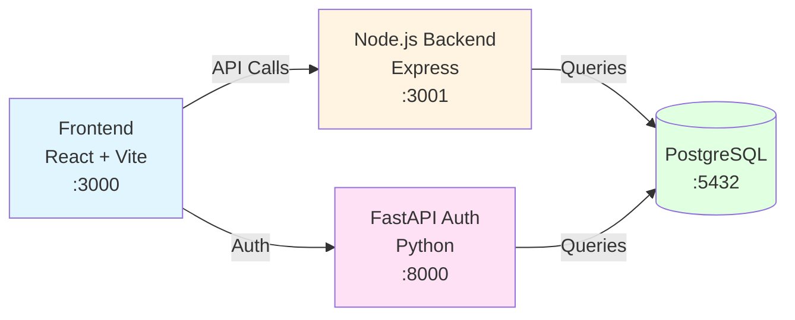

# Nova‑XFinity Setup Guide

**Last Updated:** 2026-01-10  
**Status:** Current

## Overview

Nova‑XFinity is a full-stack AI-powered application built with a modern microservices architecture:

- **Frontend**: React + Vite
- **Backend**: Node.js/Express
- **Auth Backend**: FastAPI (Python)
- **Database**: PostgreSQL

**The entire stack runs with one command: `npm run dev` (via Docker Compose).**

All services are containerized and orchestrated through Docker Compose, making setup and deployment seamless. The system automatically handles dependencies, health checks, and service communication.

### System Architecture



---

## API Key Management

Configure all API keys in your `.env` file at the project root. The `.env.example` file includes all keys by default with placeholder values.

### Supported API Keys

| Key | Description | Required |
|-----|-------------|----------|
| `GEMINI_API_KEY` | Google Gemini API (Primary AI provider) | ✅ Required |
| `OPENAI_API_KEY` | OpenAI API | Optional |
| `ANTHROPIC_API_KEY` | Anthropic Claude API | Optional |
| `GROQ_API_KEY` | Groq API (for Llama models) | Optional |
| `REPLICATE_API_KEY` | Replicate API | Optional |
| `STABILITY_API_KEY` | Stability AI API | Optional |
| `PINECONE_API_KEY` | Pinecone API | Optional |
| `WEAVIATE_API_KEY` | Weaviate API | Optional |
| `PLATFORM_API_KEY` | Platform API key (for WordPress plugin sync) | Optional |

**Note:** Only `GEMINI_API_KEY` is required for basic functionality. Other keys enable additional features and AI providers.

---

## Port Mapping

The following ports are preconfigured in `docker-compose.yml` and can be changed if needed:

| Service | Port | URL |
|---------|------|-----|
| Frontend (Vite) | 3000 | http://localhost:3000 |
| Node.js Backend | 3001 | http://localhost:3001 |
| FastAPI Auth Service | 8000 | http://localhost:8000 |
| PostgreSQL Database | 5432 | localhost:5432 |

---

## Running the Project

### ▶️ One-Command Setup (Preferred)

Run this command from the project root:

```bash
npm run dev
```

This single command:
- Builds all Docker containers
- Starts PostgreSQL database
- Launches FastAPI auth service
- Starts Node.js backend
- Runs React frontend
- Manages dependencies and health checks
- Handles service orchestration automatically

**That's it!** All services will be available at their respective ports once the containers are healthy.

### 🛠 Prerequisites

Before running `npm run dev`, ensure you have:

- **Docker Desktop** installed and running
  - [Download Docker Desktop](https://www.docker.com/products/docker-desktop)
- **Node.js** (v18 or higher) for running npm commands
  - [Download Node.js](https://nodejs.org/)
- **`.env` file** configured with at minimum:
  - `GEMINI_API_KEY` (required)
  - Database credentials
  - JWT secrets

### 📝 Initial Setup Steps

1. **Clone the repository:**
   ```bash
   git clone <repository-url>
   cd nova-xfinity-ai
   ```

2. **Copy environment template:**
   ```bash
   cp env.example .env
   ```

3. **Edit `.env` file:**
   - Add your `GEMINI_API_KEY` (required)
   - Configure other API keys as needed
   - Set database credentials
   - Generate JWT secrets (use `openssl rand -hex 32`)

4. **Start the application:**
   ```bash
   npm run dev
   ```

5. **Access the application:**
   - Frontend: http://localhost:3000
   - Auth API: http://localhost:8000
   - Backend API: http://localhost:3001

### Optional: Local Development (Advanced)

If you prefer to run services outside Docker (not recommended for beginners):

```bash
# Frontend only
npm run dev:local

# Backend services require manual setup
# See docs/development/setup.md for detailed instructions
```

---

## Troubleshooting

### Common Issues

#### Docker Not Installed

**Problem:** `npm run dev` fails with "docker: command not found"

**Solution:** 
- Install [Docker Desktop](https://www.docker.com/products/docker-desktop)
- Ensure Docker Desktop is running before executing `npm run dev`

#### Port Already in Use

**Problem:** Error message indicates port 3000, 3001, 8000, or 5432 is already in use

**Solution:**
- Stop the conflicting service using that port
- Or modify port mappings in `docker-compose.yml`:
  ```yaml
  ports:
    - "3002:3000"  # Change external port
  ```

#### Missing API Keys

**Problem:** Application starts but AI features don't work

**Solution:**
- Verify `.env` file exists in project root
- Ensure `GEMINI_API_KEY` is set (required)
- Check that API keys are not wrapped in quotes
- Review logs: `docker compose logs finity-frontend`

#### Failed Health Checks

**Problem:** Services fail to start or show unhealthy status

**Solution:**
1. Check service logs:
   ```bash
   docker compose logs finity-db
   docker compose logs finity-backend
   docker compose logs finity-backend-node
   docker compose logs finity-frontend
   ```

2. Verify `.env` configuration:
   - Database credentials are correct
   - All required secrets are set
   - No syntax errors in `.env` file

3. Rebuild containers:
   ```bash
   docker compose down
   docker compose up --build
   ```

4. Reset Docker volumes (if database issues):
   ```bash
   docker compose down -v
   docker compose up --build
   ```

#### Database Connection Issues

**Problem:** Backend services can't connect to PostgreSQL

**Solution:**
- Verify `POSTGRES_USER`, `POSTGRES_PASSWORD`, and `POSTGRES_DB` in `.env`
- Check database container is running: `docker compose ps`
- Review database logs: `docker compose logs finity-db`
- Ensure health check passed before dependent services start

### Getting Help

If issues persist:

1. **Check logs:**
   ```bash
   docker compose logs
   ```

2. **Verify environment:**
   ```bash
   docker compose config
   ```

3. **Review detailed setup guide:**
   - See `docs/development/setup.md` for advanced troubleshooting

4. **Check service status:**
   ```bash
   docker compose ps
   ```

---

## Project Structure

```
nova-xfinity-ai/
├── frontend/          # React + Vite frontend
├── backend/           # Node.js/Express backend
├── backend-auth/      # FastAPI authentication service
├── docker-compose.yml # Docker orchestration
├── .env              # Environment variables (create from env.example)
├── package.json      # Root package.json with npm run dev
└── docs/             # Documentation
```

---

## Next Steps

After successful setup:

1. **Access the frontend** at http://localhost:3000
2. **Create an admin user** (see `backend-auth/create_admin_user.py`)
3. **Configure additional API keys** for extended functionality
4. **Review API documentation** at http://localhost:8000/docs (FastAPI)
5. **Explore the codebase** using the architecture docs in `docs/architecture/`

---

## Related Documentation

- [Development Setup](development/setup.md) - Detailed development environment setup
- [Backend Architecture](architecture/backend-architecture.md) - Backend system design
- [Frontend Architecture](architecture/frontend-architecture.md) - Frontend system design
- [Docker Containerization](development/docker-containerization-system.md) - Docker setup details
- [Deployment Process](development/deployment-process.md) - Production deployment guide

---

**Quick Start Summary:**
```bash
cp env.example .env
# Edit .env with your GEMINI_API_KEY
npm run dev
# Open http://localhost:3000
```
